# smm-course-viewer: Data Format

These tables present the formats of the Super Mario Maker '.cdt' level, collected through reverse-engineering of the last version (1.47) game executable and careful examined. These formats are an upgrade of the [MarioUnmaker](https://github.com/Treeki/MarioUnmaker/blob/master/FormatNotes.md).

This file describes all [monsters](#monster) and [objects](#object) identified, their type, name, description and a wiki link.

TODO: _Rotation_
-   66 AirSignBoard
-   59 Rail
-   41 Stretch

---
## Monster

Collumns:
-   **Type**: is the main ID code of the monster.
-   **SubType**: is a transformation of the monster.
-   **Size**: normal size (`1`) or big (`2`) with a Mushroom, `None` is always normal size.
-   **Name**: internal name (Japanese) of the monster.
-   **Description**: detail of the monster.
-   **Image**: an image of the monster.
-   **Wiki**: an external link for a Wiki of the monster.

_Note: `None` is useless_.

<table>
    <tr>
        <th>Type</th><th>SubType</th><th>Size</th>
        <th>Name</th><th>Description</th>
        <th>Image</th><th>Wiki</th>
    </tr>
    <tr>
        <td>0</td><td>0</td><td>1,2</td>
        <td>Kuribo</td><td>Goomba</td>
        <td>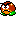</td>
        <td><a href="https://www.mariowiki.com/Goomba" target="_blank">Link</a></td>
    </tr>
    <tr>
        <td>1</td><td>0</td><td>1,2</td>
        <td>Nokonoko</td><td>Green Koopa Troopa</td>
        <td>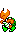</td>
        <td><a href="https://www.mariowiki.com/Koopa_Troopa" target="_blank">Link</a></td>
    </tr>
    <tr>
        <td>1</td><td>1</td><td>1,2</td>
        <td>Nokonoko</td><td>Red Koopa Troopa</td>
        <td>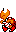</td>
        <td><a href="https://www.mariowiki.com/Koopa_Troopa" target="_blank">Link</a></td>
    </tr>
    <tr>
        <td>2</td><td>0</td><td>1,2</td>
        <td>Pakkun</td><td>Piranha Plant</td>
        <td>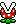</td>
        <td><a href="https://www.mariowiki.com/Piranha_Plant" target="_blank">Link</a></td>
    </tr>
    <tr>
        <td>2</td><td>1</td><td>1,2</td>
        <td>Pakkun</td><td>Fire Piranha Plant</td>
        <td>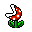</td>
        <td><a href="https://www.mariowiki.com/Piranha_Plant" target="_blank">Link</a></td>
    </tr>
    <tr>
        <td>3</td><td>0</td><td>1</td>
        <td>HammerBro</td><td>Hammer Bro</td>
        <td>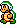</td>
        <td><a href="https://www.mariowiki.com/Hammer_Bro" target="_blank">Link</a></td>
    </tr>
    <tr>
        <td>3</td><td>0</td><td>2</td>
        <td>HammerBro</td><td>Sledge Bro</td>
        <td>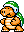</td>
        <td><a href="https://www.mariowiki.com/Sledge_Bro" target="_blank">Link</a></td>
    </tr>
    <tr>
        <td>10</td><td>0</td><td>None</td>
        <td>JumpStep</td><td>Vertical Jump Step</td>
        <td>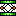</td>
        <td>None</td>
    </tr>
    <tr>
        <td>10</td><td>1</td><td>None</td>
        <td>JumpStep</td><td>Horizontal Jump Step</td>
        <td>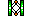</td>
        <td>None</td>
    </tr>
    <tr>
        <td>11</td><td>0</td><td>None</td>
        <td>Lift</td><td>Moving Plataform</td>
        <td></td>
        <td><a href="https://www.mariowiki.com/Lift" target="_blank">Link</a></td>
    </tr>
    <tr>
        <td>11</td><td>1</td><td>None</td>
        <td>Lift</td><td>Fall Moving Plataform</td>
        <td></td>
        <td><a href="https://www.mariowiki.com/Lift" target="_blank">Link</a></td>
    </tr>
    <tr>
        <td>12</td><td>0</td><td>1,2</td>
        <td>Dossun</td><td>Thwomp</td>
        <td>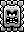</td>
        <td><a href="https://www.mariowiki.com/Thwomp" target="_blank">Link</a></td>
    </tr>
    <tr>
        <td>12</td><td>1</td><td>None</td>
        <td>Dossun</td><td>Skewer</td>
        <td>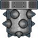</td>
        <td><a href="https://www.mariowiki.com/Skewer" target="_blank">Link</a></td>
    </tr>
    <tr>
        <td>13</td><td>0</td><td>None</td>
        <td>KillerHoudai</td><td>Bill Blaster, Cannon</td>
        <td>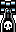</td>
        <td><a href="https://www.mariowiki.com/Bill_Blaster" target="_blank">Link</a></td>
    </tr>
    <tr>
        <td>13</td><td>1</td><td>None</td>
        <td>KillerHoudai</td><td>Bull's-Eye Blaster, Suit Blaster</td>
        <td>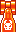</td>
        <td><a href="https://fantendo.fandom.com/wiki/Suit_Blaster" target="_blank">Link</a></td>
    </tr>
    <tr>
        <td>15</td><td>0</td><td>1,2</td>
        <td>Bombhei</td><td>Bob-omb</td>
        <td>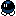</td>
        <td><a href="https://www.mariowiki.com/Bob-omb" target="_blank">Link</a></td>
    </tr>
    <tr>
        <td>15</td><td>1</td><td>1,2</td>
        <td>Bombhei</td><td>Active Bob-omb</td>
        <td>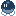</td>
        <td><a href="https://www.mariowiki.com/Bob-omb" target="_blank">Link</a></td>
    </tr>
    <tr>
        <td>18</td><td>0</td><td>None</td>
        <td>PSwitch</td><td>P Switch</td>
        <td>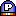</td>
        <td><a href="https://www.mariowiki.com/P_Switch" target="_blank">Link</a></td>
    </tr>
    <tr>
        <td>18</td><td>1</td><td>None</td>
        <td>PSwitch</td><td>Key</td>
        <td></td>
        <td><a href="https://www.mariowiki.com/Key" target="_blank">Link</a></td>
    </tr>
    <tr>
        <td>19</td><td>None</td><td>None</td>
        <td>PowBlock</td><td>POW Block</td>
        <td></td>
        <td><a href="https://www.mariowiki.com/POW_Block" target="_blank">Link</a></td>
    </tr>
    <tr>
        <td>20</td><td>None</td><td>None</td>
        <td>SuperKinoko</td><td>Mushroom</td>
        <td>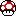</td>
        <td><a href="https://www.mariowiki.com/Mushroom" target="_blank">Link</a></td>
    </tr>
    <tr>
        <td>24</td><td>None</td><td>None</td>
        <td>FireBar</td><td>Fire Bar</td>
        <td>
            
            
        </td>
        <td><a href="https://www.mariowiki.com/Fire_Bar" target="_blank">Link</a></td>
    </tr>
    <tr>
        <td>25</td><td>0</td><td>1,2</td>
        <td>Togezo</td><td>Spiny</td>
        <td>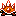</td>
        <td><a href="https://www.mariowiki.com/Spiny" target="_blank">Link</a></td>
    </tr>
    <tr>
        <td>27</td><td>None</td><td>None</td>
        <td>GoalPole</td><td>Goal Pole</td>
        <td>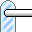</td>
        <td><a href="https://www.mariowiki.com/Goal_Pole" target="_blank">Link</a></td>
    </tr>
    <tr>
        <td>28</td><td>0</td><td>1,2</td>
        <td>Met</td><td>Buzzy Beetle</td>
        <td>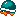</td>
        <td><a href="https://www.mariowiki.com/Buzzy_Beetle" target="_blank">Link</a></td>
    </tr>
    <tr>
        <td>30</td><td>0</td><td>1,2</td>
        <td>Jugem</td><td>Lakitu</td>
        <td>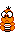</td>
        <td><a href="https://www.mariowiki.com/Lakitu" target="_blank">Link</a></td>
    </tr>
    <tr>
        <td>31</td><td>0</td><td>1,2</td>
        <td>JugemCloud</td><td>Lakitu's Cloud</td>
        <td></td>
        <td><a href="https://www.mariowiki.com/Lakitu%27s_Cloud" target="_blank">Link</a></td>
    </tr>
    <tr>
        <td>32</td><td>None</td><td>None</td>
        <td>Tsuta</td><td>Vine Head</td>
        <td>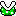</td>
        <td><a href="https://www.mariowiki.com/Beanstalk" target="_blank">Link</a></td>
    </tr>
    <tr>
        <td>33</td><td>None</td><td>None</td>
        <td>UpKinoko</td><td>1-Up Mushroom</td>
        <td>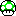</td>
        <td><a href="https://www.mariowiki.com/1-Up_Mushroom" target="_blank">Link</a></td>
    </tr>
    <tr>
        <td>34</td><td>None</td><td>None</td>
        <td>FireFlower</td><td>Fire Flower</td>
        <td>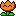</td>
        <td><a href="https://www.mariowiki.com/Fire_Flower" target="_blank">Link</a></td>
    </tr>
    <tr>
        <td>35</td><td>None</td><td>None</td>
        <td>SuperStar</td><td>Super Star</td>
        <td></td>
        <td><a href="https://www.mariowiki.com/Super_Star" target="_blank">Link</a></td>
    </tr>
    <tr>
        <td>36</td><td>0</td><td>None</td>
        <td>YouganLift</td><td>Lava Lift</td>
        <td></td>
        <td><a href="https://www.mariowiki.com/Lava_Lift" target="_blank">Link</a></td>
    </tr>
    <tr>
        <td>36</td><td>1</td><td>None</td>
        <td>YouganLift</td><td>Blue Lava Lift</td>
        <td></td>
        <td><a href="https://www.mariowiki.com/Lava_Lift" target="_blank">Link</a></td>
    </tr>
    <tr>
        <td>38</td><td>None</td><td>None</td>
        <td>StartSignBoard</td><td>Start Sign</td>
        <td>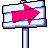</td>
        <td>None</td>
    </tr>
    <tr>
        <td>39</td><td>0</td><td>1,2</td>
        <td>Kameck</td><td>Kamek</td>
        <td>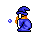</td>
        <td><a href="https://www.mariowiki.com/Kamek" target="_blank">Link</a></td>
    </tr>
    <tr>
        <td>40</td><td>0</td><td>1,2</td>
        <td>Togemet</td><td>Spike Top</td>
        <td>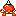</td>
        <td><a href="https://www.mariowiki.com/Spike_Top" target="_blank">Link</a></td>
    </tr>
    <tr>
        <td>40</td><td>1</td><td>1,2</td>
        <td>Togemet</td><td>Blue Spike Top</td>
        <td>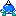</td>
        <td><a href="https://www.mariowiki.com/Spike_Top" target="_blank">Link</a></td>
    </tr>
    <tr>
        <td>41</td><td>0</td><td>1,2</td>
        <td>Teresa</td><td>Boo</td>
        <td></td>
        <td><a href="https://www.mariowiki.com/Boo" target="_blank">Link</a></td>
    </tr>
    <tr>
        <td>41</td><td>1</td><td>1,2</td>
        <td>Teresa</td><td>Circling Boo Buddies</td>
        <td></td>
        <td><a href="https://www.mariowiki.com/Circling_Boo_Buddies" target="_blank">Link</a></td>
    </tr>
    <tr>
        <td>41</td><td>0</td><td>1</td>
        <td>Teresa</td><td>Stretch</td>
        <td></td>
        <td><a href="https://www.mariowiki.com/Stretch_(Boo)" target="_blank">Link</a></td>
    </tr>
    <tr>
        <td>42</td><td>0</td><td>None</td>
        <td>KoopaClown</td><td>Koopa Clown</td>
        <td></td>
        <td><a href="https://www.mariowiki.com/Koopa_Clown_Car" target="_blank">Link</a></td>
    </tr>
    <tr>
        <td>42</td><td>1</td><td>None</td>
        <td>KoopaClown</td><td>Fire Koopa Clown</td>
        <td>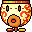</td>
        <td><a href="https://www.mariowiki.com/Fire_Koopa_Clown_Car" target="_blank">Link</a></td>
    </tr>
    <tr>
        <td>44</td><td>None</td><td>None</td>
        <td>CharaKinoko</td><td>Mystery Mushroom (M1), Super Leaf (M3), Cape Feather (MW), Propeller Mushroom (WU)</td>
        <td>
            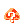,
            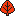,
            ,
            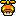
        </td>
        <td>
            <a href="https://www.mariowiki.com/Mystery_Mushroom" target="_blank">M1</a>,
            <a href="https://www.mariowiki.com/Super_Leaf" target="_blank">M3</a>,
            <a href="https://www.mariowiki.com/Cape_Feather" target="_blank">MW</a>,
            <a href="https://www.mariowiki.com/Propeller_Mushroom" target="_blank">WU</a>
        </td>
    </tr>
    <tr>
        <td>45</td><td>None</td><td>None</td>
        <td>KutsuKuribo</td><td>Goomba's Shoe, Yoshi Egg</td>
        <td>
            
            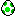
        </td>
        <td>
            <a href="https://www.mariowiki.com/Goomba%27s_Shoe" target="_blank">Shoe</a>,
            <a href="https://www.mariowiki.com/Yoshi_Egg" target="_blank">Egg</a>
        </td>
    </tr>
    <tr>
        <td>46</td><td>0</td><td>1,2</td>
        <td>Karon</td><td>Dry Bones</td>
        <td>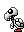</td>
        <td><a href="https://www.mariowiki.com/Dry_Bones" target="_blank">Link</a></td>
    </tr>
    <tr>
        <td>46</td><td>0</td><td>1,2</td>
        <td>Karon</td><td>Fish Bones</td>
        <td></td>
        <td><a href="https://www.mariowiki.com/Fish_Bone" target="_blank">Link</a></td>
    </tr>
    <tr>
        <td>47</td><td>0</td><td>None</td>
        <td>SenkanHoudai</td><td>Cannon</td>
        <td>
            
            
        </td>
        <td><a href="https://www.mariowiki.com/Cannon" target="_blank">Link</a></td>
    </tr>
    <tr>
        <td>47</td><td>1</td><td>None</td>
        <td>SenkanHoudai</td><td>Red Cannon</td>
        <td>
            
            
        </td>
        <td><a href="https://www.mariowiki.com/Cannon" target="_blank">Link</a></td>
    </tr>
    <tr>
        <td>48</td><td>0</td><td>1,2</td>
        <td>Gesso</td><td>Blooper</td>
        <td></td>
        <td><a href="https://www.mariowiki.com/Blooper" target="_blank">Link</a></td>
    </tr>
    <tr>
        <td>48</td><td>1</td><td>1,2</td>
        <td>Gesso</td><td>Blooper Nanny</td>
        <td>
            
            
        </td>
        <td><a href="https://www.mariowiki.com/Blooper_Nanny" target="_blank">Link</a></td>
    </tr>
    <tr>
        <td>50</td><td>None</td><td>None</td>
        <td>FunnyKinoko</td><td>Weird Mushroom</td>
        <td></td>
        <td><a href="https://www.mariowiki.com/Weird_Mushroom_(item)" target="_blank">Link</a></td>
    </tr>
    <tr>
        <td>51</td><td>None</td><td>None</td>
        <td>DekaKinoko</td><td>Mega Mushroom</td>
        <td></td>
        <td><a href="https://www.mariowiki.com/Mega_Mushroom" target="_blank">Link</a></td>
    </tr>
    <tr>
        <td>52</td><td>0</td><td>1,2</td>
        <td>Hanachan</td><td>Wiggler</td>
        <td>
            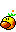
            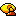
        </td>
        <td><a href="https://www.mariowiki.com/Wiggler" target="_blank">Link</a></td>
    </tr>
    <tr>
        <td>52</td><td>1</td><td>1,2</td>
        <td>Hanachan</td><td>Angry Wiggler</td>
        <td>
            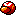
            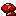
        </td>
        <td><a href="https://www.mariowiki.com/Wiggler" target="_blank">Link</a></td>
    </tr>
    <tr>
        <td>54</td><td>0</td><td>None</td>
        <td>Burner</td><td>Burner</td>
        <td></td>
        <td><a href="https://www.mariowiki.com/Burner" target="_blank">Link</a></td>
    </tr>
    <tr>
        <td>55</td><td>0</td><td>None</td>
        <td>Door</td><td>Warp Door</td>
        <td>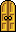</td>
        <td><a href="https://www.mariowiki.com/Warp_Door" target="_blank">Link</a></td>
    </tr>
    <tr>
        <td>55</td><td>1</td><td>None</td>
        <td>Door</td><td>P Door</td>
        <td>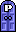</td>
        <td><a href="https://www.mariowiki.com/P_Door" target="_blank">Link</a></td>
    </tr>
    <tr>
        <td>55</td><td>2</td><td>None</td>
        <td>Door</td><td>Key Door</td>
        <td>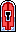</td>
        <td><a href="https://www.mariowiki.com/Key_Door" target="_blank">Link</a></td>
    </tr>
    <tr>
        <td>56</td><td>0</td><td>1,2</td>
        <td>Pukupuku</td><td>Cheep Cheep</td>
        <td>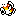</td>
        <td><a href="https://www.mariowiki.com/Cheep_Cheep" target="_blank">Link</a></td>
    </tr>
    <tr>
        <td>56</td><td>1</td><td>1,2</td>
        <td>Pukupuku</td><td>Deep Cheep</td>
        <td>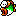</td>
        <td><a href="https://www.mariowiki.com/Deep_Cheep" target="_blank">Link</a></td>
    </tr>
    <tr>
        <td>57</td><td>0</td><td>1,2</td>
        <td>BlackPakkun</td><td>Muncher</td>
        <td>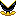</td>
        <td><a href="https://www.mariowiki.com/Muncher" target="_blank">Link</a></td>
    </tr>
    <tr>
        <td>58</td><td>0</td><td>1,2</td>
        <td>Poo</td><td>Rocky Wrench</td>
        <td>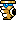</td>
        <td><a href="https://www.mariowiki.com/Rocky_Wrench" target="_blank">Link</a></td>
    </tr>
    <tr>
        <td>58</td><td>1</td><td>1,2</td>
        <td>Poo</td><td>Monty Mole</td>
        <td>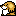</td>
        <td><a href="https://www.mariowiki.com/Monty_Mole" target="_blank">Link</a></td>
    </tr>
    <tr>
        <td>60</td><td>0</td><td>1,2</td>
        <td>Bubble</td><td>Lava Bubble</td>
        <td></td>
        <td><a href="https://www.mariowiki.com/Lava_Bubble" target="_blank">Link</a></td>
    </tr>
    <tr>
        <td>61</td><td>0</td><td>1,2</td>
        <td>Wanwan</td><td>Chain Chomp</td>
        <td></td>
        <td><a href="https://www.mariowiki.com/Chain_Chomp" target="_blank">Link</a></td>
    </tr>
    <tr>
        <td>61</td><td>1</td><td>1,2</td>
        <td>Wanwan</td><td>Chain Chomp</td>
        <td>
            
            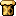
        </td>
        <td><a href="https://www.mariowiki.com/Chain_Chomp" target="_blank">Link</a></td>
    </tr>
    <tr>
        <td>62</td><td>0</td><td>1,2</td>
        <td>Koopa</td><td>Bowser</td>
        <td>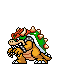</td>
        <td><a href="https://www.mariowiki.com/Bowser" target="_blank">Link</a></td>
    </tr>
    <tr>
        <td>62</td><td>1</td><td>1,2</td>
        <td>Koopa</td><td>Bowser Jr.</td>
        <td>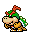</td>
        <td><a href="https://www.mariowiki.com/Bowser_Jr." target="_blank">Link</a></td>
    </tr>
    <tr>
        <td>66</td><td>0</td><td>None</td>
        <td>AirSignBoard</td><td>Air Sign</td>
        <td></td>
        <td>None</td>
    </tr>
    <tr>
        <td>66</td><td>1</td><td>None</td>
        <td>AirSignBoard</td><td>Checkpoint Flag</td>
        <td></td>
        <td><a href="https://www.mariowiki.com/Checkpoint_Flag" target="_blank">Link</a></td>
    </tr>
    <tr>
        <td>67</td><td>None</td><td>None</td>
        <td>HalfHitWall</td><td>One-Way Wall</td>
        <td></td>
        <td><a href="https://www.mariowiki.com/One-Way_Wall" target="_blank">Link</a></td>
    </tr>
    <tr>
        <td>68</td><td>0</td><td>None</td>
        <td>Saw</td><td>Grinder</td>
        <td>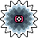</td>
        <td><a href="https://www.mariowiki.com/Grinder" target="_blank">Link</a></td>
    </tr>
    <tr>
        <td>68</td><td>1</td><td>None</td>
        <td>Saw</td><td>Bumper</td>
        <td></td>
        <td><a href="https://www.mariowiki.com/Bumper_(Super_Mario_Maker)" target="_blank">Link</a></td>
    </tr>
    <tr>
        <td>65, 69</td><td>None</td><td>None</td>
        <td>Player</td><td>Mario</td>
        <td></td>
        <td><a href="https://www.mariowiki.com/Mario" target="_blank">Link</a></td>
    </tr>
</table>

---
## Object

Collumns:
-   **Type**: is the main ID code of the object.
-   **Name**: internal name (Japanese) of the object.
-   **Description**: detail of the object.
-   **Image**: an image of the object.
-   **Wiki**: an external link for a Wiki of the object.

_Note: `None` is useless_.

<table>
    <tr>
        <th>Type</th><th>Name</th><th>Description</th>
        <th>Image</th><th>Wiki</th>
    </tr>
    <tr>
        <td>4</td><td>RengaBlock</td><td>Brick Block</td>
        <td></td>
        <td><a href="https://www.mariowiki.com/Brick_Block" target="_blank">Link</a></td>
    </tr>
    <tr>
        <td>5</td><td>HatenaBlock</td><td>'?' Block</td>
        <td></td>
        <td><a href="https://www.mariowiki.com/%3F_Block" target="_blank">Link</a></td>
    </tr>
    <tr>
        <td>6</td><td>HardBlock</td><td>Hard Block</td>
        <td></td>
        <td><a href="https://www.mariowiki.com/Hard_Block" target="_blank">Link</a></td>
    </tr>
    <tr>
        <td>7</td><td>Ground</td><td>Ground</td>
        <td></td>
        <td>None</td>
    </tr>
    <tr>
        <td>8</td><td>Coin</td><td>Coin</td>
        <td></td>
        <td><a href="https://www.mariowiki.com/Coin" target="_blank">Link</a></td>
    </tr>
    <tr>
        <td>8</td><td>Coin</td><td>Pink Coin</td>
        <td></td>
        <td><a href="https://www.mariowiki.com/Pink_Coin_(Super_Mario_Maker)" target="_blank">Link</a></td>
    </tr>
    <tr>
        <td>9</td><td>Dokan</td><td>Warp Pipe</td>
        <td></td>
        <td><a href="https://www.mariowiki.com/Warp_Pipe" target="_blank">Link</a></td>
    </tr>
    <tr>
        <td>14</td><td>GroundMushroom</td><td>Terrain Mushroom</td>
        <td>
            
            
            
        </td>
        <td>None</td>
    </tr>
    <tr>
        <td>16</td><td>GroundBox</td><td>Terrain</td>
        <td>
            
            
            
        </td>
        <td>None</td>
    </tr>
    <tr>
        <td>17</td><td>Bridge</td><td>Bridge</td>
        <td></td>
        <td>None</td>
    </tr>
    <tr>
        <td>21</td><td>ChikuwaBlock</td><td>Donut Block</td>
        <td></td>
        <td><a href="https://www.mariowiki.com/Donut_Block" target="_blank">Link</a></td>
    </tr>
    <tr>
        <td>22</td><td>KumoBlock</td><td>Cloud Block</td>
        <td></td>
        <td><a href="https://www.mariowiki.com/Cloud_Block" target="_blank">Link</a></td>
    </tr>
    <tr>
        <td>23</td><td>OnpuBlock</td><td>Note Block</td>
        <td></td>
        <td><a href="https://www.mariowiki.com/Note_Block" target="_blank">Link</a></td>
    </tr>
    <tr>
        <td>23</td><td>OnpuBlock</td><td>Super Note Block</td>
        <td></td>
        <td><a href="https://www.mariowiki.com/Super_Note_Block" target="_blank">Link</a></td>
    </tr>
    <tr>
        <td>26</td><td>GroundGoal</td><td>Ground</td>
        <td></td>
        <td>None</td>
    </tr>
    <tr>
        <td>29</td><td>ClearBlock</td><td>Clear '?' Block</td>
        <td></td>
        <td><a href="https://www.mariowiki.com/%3F_Block" target="_blank">Link</a></td>
    </tr>
    <tr>
        <td>37</td><td>GroundStart</td><td>Ground</td>
        <td></td>
        <td>None</td>
    </tr>
    <tr>
        <td>43</td><td>Toge</td><td>Spiny Block</td>
        <td></td>
        <td>None</td>
    </tr>
    <tr>
        <td>49</td><td>CastleBridge</td><td>Castle Bridge</td>
        <td></td>
        <td>None</td>
    </tr>
    <tr>
        <td>53</td><td>BeltConveyor</td><td>Conveyor Belt Sprint</td>
        <td></td>
        <td><a href="https://www.mariowiki.com/Conveyor_Belt_Sprint" target="_blank">Link</a></td>
    </tr>
    <tr>
        <td>59</td><td>Rail</td><td>Rail Lift</td>
        <td></td>
        <td><a href="https://www.mariowiki.com/Rail_Lift" target="_blank">Link</a></td>
    </tr>
    <tr>
        <td>63</td><td>IceBlock</td><td>Ice Block</td>
        <td></td>
        <td><a href="https://www.mariowiki.com/Ice_Block" target="_blank">Link</a></td>
    </tr>
    <tr>
        <td>64</td><td>Tsuta</td><td>Vine Body</td>
        <td></td>
        <td><a href="https://www.mariowiki.com/Beanstalk" target="_blank">Link</a></td>
    </tr>
</table>

---
## Also look ~

-   Create by Leonardo Mauro ~ [leomaurodesenv](https://github.com/leomaurodesenv/)
-   GitHub: [smm-course-viewer](https://github.com/leomaurodesenv/smm-course-viewer)
